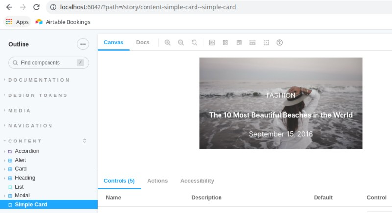

# Hands On talk about Web Components

## Cloning this repository

This top repository goes together with two other repos:

- https://github.com/weknowinc/outline-phase2/tree/handson-freeze
- https://github.com/weknowinc/webcomponents_wk_handson

To pull them all together you'll need to run the following **git clone** command:

```
git clone --recurse-submodules --remote-submodules --branch main git@github.com:weknowinc/webcomponents_handson.git
```

If you already cloned it, there is a script (`fix_repo.sh`) which will do the same.

## Setting up your sandbox environment

```
fin init
fin wk-setup
fin drush uli
```

This will leave you with a Drupal 9.1 installation using Olivero as the theme and some content.
Once you fetch Phase2's [Outline](https://github.com/phase2/outline) design system you'll be ready to start the hands on.

There are additional commands you might find useful:

- ```fin wk-up-outline```: Compiles outline and update Drupal theme with it

### Using Phase2 Outline

For outline you'll need to use [Node v16](https://nodejs.org/en/download/package-manager/#nvm) & [Yarn v1](https://classic.yarnpkg.com/lang/en/docs/install/).
Once you have them installed you can run the following commands:

```
cd outline/
yarn install
yarn start
```

This will start Storybook and keep updating when you do changes.

If you need to run a build or check compiled output you can run:

```
yarn build
```

## webComponent examples

When using outline/webComponents you'll have two realms:

- The Storybook version of the component where you can refine and test it.
- The compiled version of your webComponent which you will export to Drupal and use it in your template.

These are examples which you will be able to check within Storybook. In the next chapter "Drupal Integration" we will use them.

### Before we start

Some brief background about outline and technologies behind it:

- webComponents have been around for a while now ([v1 implementation 2018](https://medium.com/@pablortsal/the-year-of-web-components-c92960830d00)) and it is supported by [most mayor browsers](https://developer.mozilla.org/en-US/docs/Web/Web_Components#browser_compatibility).
- You can use webComponents directly by calling the browawe API, but it is simpler to use libraries like [StencilJS](https://stenciljs.com/) or [LitJS](https://lit.dev/) (currently being used by Outline).
- webComponents use a [ShadowDOM](https://developer.mozilla.org/en-US/docs/Web/Web_Components/Using_shadow_DOM): This shadow DOM tree is rendered separately from the main document DOM. It allows to encapsulate your CSS within it, and protects it from outside interference. As a side effect, styles from outside won't have any effect on your webComponent.
- All webComponents have a [lifeCycle](https://developer.mozilla.org/en-US/docs/Web/Web_Components/Using_custom_elements#using_the_lifecycle_callbacks) and they are similar to React components.
- For people using Drupal, there is an initiative to create webComponents for different Drupal objects. In particular the [decouple Menus/module initiative](https://www.drupal.org/project/decoupled_menus_initiative) is an interesting starting point ([mentioned by Druies in Dcon2020EU](https://dri.es/state-of-drupal-presentation-july-2020)).


In this handson you'll have examples of how to create a webComponent using outline, pass to it attributes, use slots to receive HTML, and finally using all together.

These are some Web Components 101 articles you might find useful:

- [History](https://dev.to/this-is-learning/web-components-101-history-2p24)
- [Vanilla JavaScript](https://dev.to/this-is-learning/web-components-101-vanilla-javascript-2pja)
- [Lit Framework](https://dev.to/this-is-learning/web-components-101-lit-framework-3en1)
- [Framework Comparison](https://dev.to/this-is-learning/web-components-101-framework-comparison-989)

### Scenario 1: webComponent Hello World

In the [initial example](https://github.com/weknowinc/webcomponents_wk_handson/tree/main/wk-hello) you'll find 3 files:

- The style file `wk-hello.css`: Which in this initial case doesn't have code.
- The TypeScript file with the webComponent description `wk-hello.ts`: Interesting thing about it is the inclussion of LIT an outline components which make everything work. In this simple example we create a component, nothing more.
- The Storybook file `wk-hello.stories.ts` with an example use of the defined webComponent: It just shows the created webComponent.



Once you have run Yarn you'll also have an output file used by Storybook's implementation `wk-hello.css.lit.ts` which has the compiled output and should be ignored (it is used by the Storybook implementation).

### Scenario 2: webComponent gets simple string attributes

For [this example](https://github.com/weknowinc/webcomponents_wk_handson/tree/main/wk-simple-card) we use attributes to configure the webComponent:

- The style file `wk-simple-card.css`: The only say to say about it is the particular syntax to refer to the webcomponent name. Instead of the name, we add "&" and that will be interpreted as the webcomponent name.
- The TypeScript file with the webComponent description `wk-simple-card.ts`: You can first see the explicit declaration of the attributes (aka property) and the html template which uses the properties.
- The Storybook file `wk-simple-card.stories.ts` with an example use of the defined webComponent: This also can be used as an implementation example. You will first need to export the properties, grab them in the template and use the webComponent.

As opposed to the initial example, these does use CSS rules which are compiled into `wk-simple-card.css.lit.ts` so `wk-simple-card.stories.ts` can use them.

### Scenario 3: webComponent gets data as slots

We will now use slots instead of properties to pass information to the webComponent. As we saw attributes could be string, but if you use slots you can pass HTML code directly to the webComponent. In [this example](https://github.com/weknowinc/webcomponents_wk_handson/tree/main/wk-biography) we will use a single (default) slot, but we will see later that we could have more.

By using the [HTMLSlotElement](https://developer.mozilla.org/en-US/docs/Web/API/HTMLSlotElement) (`<slot></slot>`) we can pass to the webComponent the HTML we want it to render inside it (see [Lit exaplanation](https://lit.dev/docs/components/shadow-dom/#slots)).

### Scenario 4: webComponent gets more complex data

This example uses together attributes and slots.

IMPORTANT: I fail to see the connection. The slot makes sense, but I don't exactly see how the rounded is passed on...


## Drupal Integration

First we derived from Drupal's latest theme Olivero a subtheme we are calling "weKnow Outline Theme", within it's ```wkth.libraries.yml``` file we include the outline output JS+CSS and configure it so webComponents are available to the theme. The only difference between a regular subtheme with JS+CSS inclusion and the export of webComponents can be seen in this screenshot:


Once this is done (you have it pre-setup in this hands on), you can simply tweak the twig file as you would always do. The "attributes type module" is what makes them "magically" available. Now you can use the webComponents on your twig.

Now in the template ```src/wkth/templates/content/node--teaser.html.twig``` we can see the use of ```wk-complex-card``` webCompenent and pass one the attribute "rounded" and the slot "heading". That's enough to glue everything together.

## CleanUp

```
fin stop
fin project remove
rm -Rf node_modules
rm -Rf outline
rm -Rf vendor
rm -Rf web
```
